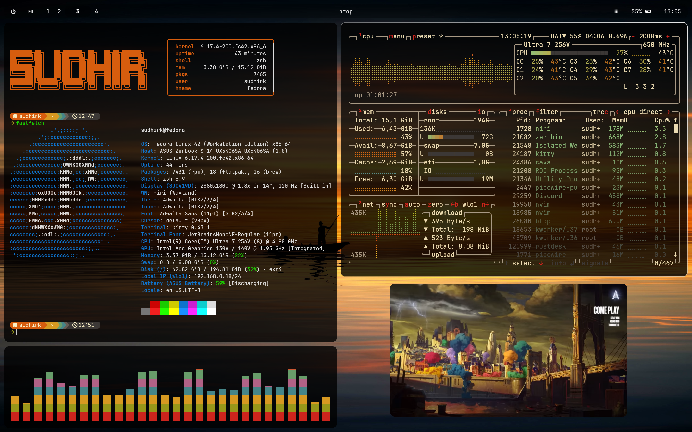
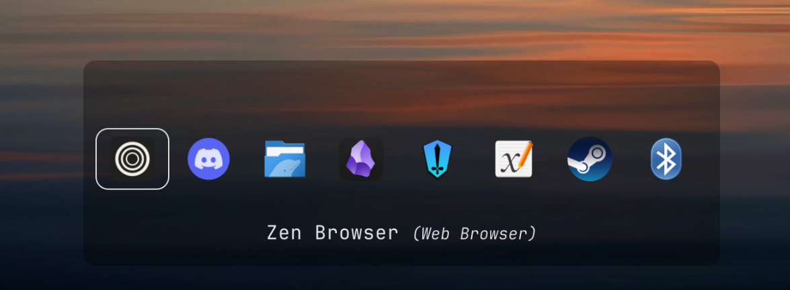

# Minimalistic OLED Centric Niri Rice (and other stuff)

This is my (gruvbox-adjacent) Niri rice with a focus on transparency and changing pixels to preserve OLED screens. Most of my configuration focuses on Translucent Widgets and turning off the screen, combined with a wallpaper that changes every two minutes.

## My Setup

| Tool | Application |
|:-----------:|:----:|
| Distro | Fedora 42 |
| Window Manager | Niri |
| Status Bar | Waybar |
| Wallpaper Daemon | awww|
| Resource Monitor | btop |
| Lock Screen | hyprlock |
| Idle Daemon | hypridle |
| Notification Manager | mako |
| File Manager | yazi |
| App Launcher | rofi |
| GRUB Theme | Grubshin Bootpact |

| Terminal Stuff | Application |
|:--------------:|:------------:|
|Terminal Emulator|Kitty|
|Shell|zsh|
|Fetch|fastfetch|
|Prompt|starship|
|Multiplexer|zellij|
|Editor|Neovim|

## Screenshots and GIFs (Outdated)

Screenshots:

Rofi

Neovim

Overview

